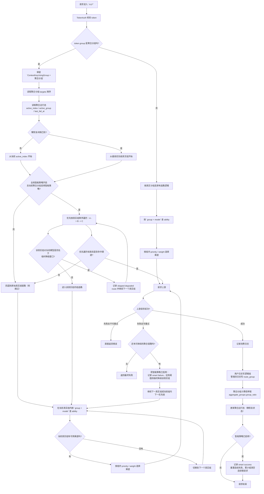

# 聚合分组设计说明

## 目标

在不破坏现有“真实分组 -> ability -> channel”底层结构的前提下，为 `new-api` 增加一层对外可见的聚合分组：

- token 仍然单选一个 `group`
- token 可以绑定真实分组或聚合分组
- 企业用户创建 token 时只看到聚合分组
- 聚合分组内部按真实分组顺序选路、失败切换、懒恢复
- 聚合分组支持单组切换 `failover` / `cluster` 路由模式
- `cluster` 模式下多个子分组可同时承接流量，并通过 route affinity 降低用户频繁跳组导致的缓存损失
- 运行态展示每个子分组最近 60 秒 RPM
- 最终计费倍率固定取聚合分组倍率，不跟随底层真实组倍率变化

## 范围与边界

V1 已实现：

- 独立的聚合分组数据模型与管理员 CRUD
- 聚合分组绑定多个真实分组并支持顺序
- 请求按聚合分组展开真实分组链路
- 请求失败后沿用现有 retry 机制在真实分组链路内继续 fallback
- 默认 `routing_mode=failover`，已有聚合分组保持原 `A -> B -> C` 行为
- 可将单个聚合分组切换为 `cluster`，按子分组权重分发请求
- `cluster` 模式使用平台用户 ID 做聚合层子分组亲和：`aggregate_group + user_id -> route_group`；选中前仍校验该子分组是否支持当前模型
- target 支持 `weight`，默认 100，允许 0 表示不参与普通加权但仍可被保留和亲和命中
- 运行态按 `aggregate_group + model + route_group` 汇总最近 60 秒 `attempt/success/failure` RPM
- 聚合分组运行时状态按 `聚合分组 + 模型` 维度存储
- 恢复采用懒恢复，不引入后台扫描任务
- 聚合分组倍率覆盖最终 group ratio
- 聚合分组支持独立配置“状态码重试规则”，覆盖系统默认 retry 状态码策略
- token 页、定价页、模型页、用户分组接口不再向企业用户暴露底层真实组

V1 不做：

- 聚合分组嵌套聚合分组
- 模型级 fallback 链
- 基于错误率/成功率的自动学习或健康度跳过
- 独立后台定时恢复任务

## 数据结构

新增表：

### `aggregate_groups`

- `id`
- `name`
- `display_name`
- `description`
- `status`
- `group_ratio`
- `routing_mode`
- `smart_routing_enabled`
- `recovery_enabled`
- `recovery_interval_seconds`
- `cluster_affinity_ttl_seconds`
- `retry_status_codes`
- `visible_user_groups`
- `created_time`
- `updated_time`
- `deleted_at`

说明：

- `visible_user_groups` 使用 `TEXT` 存 JSON 数组，兼容 SQLite / MySQL / PostgreSQL
- `retry_status_codes` 使用 `TEXT` 存状态码范围字符串，例如 `401,403,429,500-599`
- `status` 使用启用/禁用整型状态，风格与现有模型一致
- `cluster_affinity_ttl_seconds` 表示 `cluster` 模式下同一平台用户尽量固定到同一子分组的时间，默认 300 秒；`failover` 下不生效

### `aggregate_group_targets`

- `id`
- `aggregate_group_id`
- `real_group`
- `order_index`
- `weight`

说明：

- 一个聚合分组至少有一个 target
- `real_group` 只能引用真实分组，不能引用聚合分组
- `order_index` 表示链路优先级，值越小优先级越高
- `weight` 表示 `cluster` 模式下的加权分发权重，默认 100；允许配置为 0

### 路由模式

`aggregate_groups.routing_mode` 当前支持：

- `failover`
  - 默认值，兼容所有已有线上聚合分组
  - 按 target 顺序形成 `A -> B -> C` 链路
  - 懒恢复、智能策略、组内 retry、fallback 语义保持不变
- `cluster`
  - 多个真实子分组同时参与承接流量
  - 首先按平台用户 ID 和聚合分组名读取 route affinity，命中且目标子分组支持当前模型并可用时优先使用该子分组
  - 未命中亲和时，从支持当前模型且有可用 channel 的子分组中按 `effective_weight` 加权随机选择
  - 智能策略触发的 degraded 子分组不再直接剔除，而是临时降权参与选择：`effective_weight=max(1, weight*cluster_degraded_weight_percent%)`
  - 如果原始 `weight=0`，degraded 期间 `effective_weight` 仍为 0，不因为降权变成 1
  - 手动禁用、无可用 channel、不支持当前模型仍属于硬不可用，不进入候选
  - `Fallback` 只用于运行态展示：当健康候选为空且降级节点仍在兜底接流量时标记，不代表路由强行跳过其他健康节点
  - 当前子分组内部仍按现有 `common.RetryTimes` 与 priority 层级重试；耗尽后从本次请求尚未尝试过的其他子分组中继续按权重选择
  - 成功后写入独立 route affinity：`aggregate_group + user_id -> route_group`
  - `cluster_affinity_ttl_seconds` 控制 route affinity 的保持时间，默认 300 秒；到期后允许重新按当前权重选择

route affinity 不复用已有 channel affinity 的 `channel_id` 缓存，独立 namespace 为 `new-api:aggregate_route_affinity:v3`。聚合层只关心平台用户 ID 和聚合分组，模型只作为子分组能力校验条件；请求体里的 `prompt_cache_key`、`metadata.user_id` 等字段继续留给 channel affinity 处理“子分组内部选择具体上游号池”的问题。

## 运行时设计

### 请求流转图

### 两类分组概念

- 逻辑组 / 计费组：`token.group`
- 实际选路组：当前请求命中的真实分组

对于真实分组 token：

- `ContextKeyUsingGroup` 继续等于真实分组

对于聚合分组 token：

- `ContextKeyUsingGroup` 保持聚合分组名
- `ContextKeyAggregateGroup` 保存聚合分组名
- `ContextKeyRouteGroup` 保存实际命中的真实分组
- `ContextKeyRouteGroupIndex` 保存实际命中的真实分组顺序
- `ContextKeyAggregateStartIndex` 保存本次请求开始时的优先级起点
- `ContextKeyAggregateRetryIndex` 保存失败后下一次 retry 应从哪个真实分组继续
- `ContextKeyAggregateSmartRouting` 保存当前请求是否启用聚合智能策略
- 聚合运行态会记录产生它的 `routing_mode`，避免 `cluster` 的活跃子分组污染切回 `failover` 后的链式起点

### 选路策略

- 入口判断 `token.group` 是否为聚合分组
- 若不是，沿用现有真实分组选路逻辑
- 若是，读取聚合分组 targets，按顺序展开
- 每个真实分组内部继续复用现有 `ability` + `priority` + `weight` 选路逻辑
- `common.RetryTimes` 表示当前真实分组内部重试预算；例如 `RetryTimes=2` 时，当前真实分组最多会被尝试 `1 + 2` 次
- 当前真实分组上游返回“可重试失败”时，只要当前真实分组内部预算未耗尽，下一次 retry 仍留在当前真实分组
- 即使当前真实分组只有一个渠道或一个 priority，也会在内部预算内继续重试该真实分组；底层选渠道会把超出的 priority retry 收敛到最后一个可用 priority
- 当前真实分组内部预算耗尽后，才切换到下一个真实分组
- 切到下一个真实分组后，该真实分组内部始终从自己的最高优先级开始选路
- 若当前真实分组内部存在更低优先级可用渠道，则会先在当前真实分组内继续尝试下一优先级，再切换到下一个真实分组
- 若聚合分组从 `cluster` 切回 `failover`，`failover` 会忽略 `cluster` 产生的运行态；对于旧版本遗留的 `active_index > 0` 且 `last_fail_at = 0` 状态，也会从链路头部重新开始，避免卡在禁用的后序节点上

`cluster` 模式下，选路顺序变为：

- 使用 `aggregate_group + user_id` 解析 route affinity，命中且 route 支持当前模型并可用时直接选中
- 如果 route affinity 命中的子分组正处于智能降级窗口，则不直接固定命中，而是作为降权候选参与本轮加权选择
- 未命中时构造候选子分组：
  - 必须支持当前模型
  - 必须存在可用 channel
  - 手动禁用的子分组不进入候选
  - 智能策略启用时，临时降级子分组仍进入候选，但 `effective_weight=max(1, weight*cluster_degraded_weight_percent%)`
  - 权重为 0 的子分组不参与普通加权随机，降级后仍保持 `effective_weight=0`；当所有候选权重都为 0 时退化为均匀随机
- 选中子分组后，先按 `common.RetryTimes` 用完该子分组内部预算；预算耗尽后，再从本次请求尚未尝试过的其他子分组中继续按权重选择
- 本次请求内跨子分组 retry 会记录已尝试 route，避免跨组 fallback 后反复冲击同一个失败子分组
- 首次成功或切换子分组成功时写入 route affinity，使后续同一用户优先回到成功的子分组；用户切换模型时，如果原子分组支持该模型，也会继续复用
- 若后续仍命中同一子分组，成功不会继续延长 route affinity TTL；`cluster_affinity_ttl_seconds` 到期后会重新按权重选择
- 若请求开始时命中旧 route affinity，但请求完成时 TTL 已过期，成功回写也不会把旧 route 重新续期，避免稳定流量把低权重 fallback 子分组长期粘住

### 智能策略 V1

- 智能策略只有在以下两个条件同时满足时才会生效：
  - 全局 `aggregate_group.smart_strategy_enabled = true`
  - 当前聚合分组 `smart_routing_enabled = true`
- 智能策略不改数据库中配置的真实分组顺序，只在运行时改变已降级真实分组的参与方式
- `failover` 当前实现是“软跳过”：
  - 先尝试跳过处于临时降级窗口的真实分组
  - 如果优先遍历一轮后没有选中任何渠道，则回退到原始真实组链路再尝试一次，避免直接把旧逻辑硬改成强熔断
- `cluster` 当前实现是“降权而非直接跳过”：
  - degraded 子分组仍参与候选，但使用 `effective_weight=max(1, weight*cluster_degraded_weight_percent%)`
  - `cluster_degraded_weight_percent` 由全局智能策略配置项 `aggregate_group.cluster_degraded_weight_percent` 控制，默认 20，取值范围 1 到 100
  - `weight=0` 的 degraded 子分组继续保持 `effective_weight=0`
  - 降级窗口到期后恢复为原始 `weight`
  - 该策略只影响智能策略触发的 degraded 状态，不改变手动禁用、无可用 channel、不支持模型等硬不可用判断
- 不支持模型负缓存未引入：
  - 现有 `abilities` 选路本身已会按 `group + model` 过滤不支持该模型的真实分组
  - 因此第一版不额外增加“不支持模型禁用多久”逻辑

### 智能降级状态

运行时智能降级状态按 `aggregate_group + model + route_group` 存储，独立于旧的聚合运行态：

- `consecutive_failures`
- `consecutive_slows`
- `degraded_until`
- `last_failure_at`
- `last_slow_at`
- `last_success_at`

触发规则：

- 连续失败达到阈值：
  - 命中当前聚合组允许继续 fallback 的错误后，累计 `consecutive_failures`
  - 达到阈值后，将该真实分组对该模型临时降级 `degrade_duration_seconds`
- 连续慢请求达到阈值：
  - 请求成功但耗时超过 `slow_request_threshold_seconds` 时，累计 `consecutive_slows`
  - 达到阈值后，将该真实分组对该模型临时降级 `degrade_duration_seconds`
- 成功后：
  - `consecutive_failures` 清零
  - 若本次不慢，`consecutive_slows` 清零

### 两层恢复语义

当前聚合分组存在三套恢复 / 回流语义，作用不同：

- 懒恢复（旧逻辑）
  - 由聚合分组自身 `recovery_enabled / recovery_interval_seconds` 控制
  - `failover` 下作用是决定“下一次请求从哪个真实分组开始尝试”
  - 例如降级到第二真实组后，恢复间隔到了，就会重新从第一个真实组开始探测
- Cluster route affinity（新逻辑）
  - 由聚合分组自身 `cluster_affinity_ttl_seconds` 控制，默认 300 秒
  - `cluster` 下作用是决定“用户到子分组的亲和多久允许重新按权重选择”
  - 例如用户从便宜高权重子分组 A 故障迁移到 B 后，亲和保持时间到期才允许重新按权重回流到 A
- 智能降级恢复（新逻辑）
  - 由全局 `aggregate_group.degrade_duration_seconds` 控制
  - `failover` 下作用是决定“某个真实分组对某个模型是否仍应被临时跳过”
  - `cluster` 下作用是决定“某个真实分组对某个模型是否仍应按配置比例降权”
  - 降级窗口到期后，该真实分组恢复原始权重或优先级，并打印 `aggregate smart strategy recovered route`

两者叠加后的实际语义是：

- 懒恢复负责“恢复起始优先级”
- 智能降级负责“该优先级对应的真实分组当前是否应跳过（failover）或降权（cluster）”

### 聚合分组级重试状态码规则

- 聚合分组新增 `retry_status_codes` 配置项
- 留空时：沿用系统全局状态码重试规则
- 非空时：仅当前聚合分组按该配置判断“状态码是否允许继续 A -> B -> C”
- 格式复用现有状态码范围语法，例如：
  - `401,403,429,500-599`
  - `500-599`
  - `401,429`
- 该配置只覆盖“基于 HTTP 状态码”的 retry 判断
- `skip_retry` 错误、显式不可重试错误仍不会进入聚合 fallback
- 非状态码网络错误（如 `client.Do` 失败）仍按现有非状态码失败逻辑处理

### 懒恢复状态

运行时状态按 `aggregate_group + model` 存储：

- `active_index`
- `active_group`
- `last_fail_at`
- `last_success_at`
- `last_switch_at`

优先存 Redis；无 Redis 时退化为进程内 `sync.Map`。

恢复规则：

- 若当前已降级且恢复间隔未到，则从 `active_index` 开始
- 若恢复间隔已到，则从最高优先级真实分组重新探测
- 只有成功请求才会更新持久状态
- 回到最高优先级真实分组成功后，清空失败时间并恢复 `active_index = 0`

### 智能策略全局配置

当前全局配置项通过 `Option` 持久化，集中挂在 `aggregate_group.*` 命名空间：

- `aggregate_group.smart_strategy_enabled`
- `aggregate_group.consecutive_failure_threshold`
- `aggregate_group.degrade_duration_seconds`
- `aggregate_group.cluster_degraded_weight_percent`
- `aggregate_group.slow_request_threshold_seconds`
- `aggregate_group.consecutive_slow_threshold`

这些配置只影响已开启 `smart_routing_enabled` 的聚合分组。

### 实时 RPM

运行态新增子分组级实时 RPM：

- 维度：`aggregate_group + model + route_group`
- 指标：
  - `rpm`：最近 60 秒 attempt 数
  - `success_rpm`：最近 60 秒 success 数
  - `failure_rpm`：最近 60 秒 failure 数
- Redis 可用时写 Redis 秒级 bucket，TTL 120 秒
- Redis 不可用时使用进程内内存 map，按同样窗口汇总
- RPM 只用于展示，当前版本不参与路由决策
- 运行态 route 节点返回 `weight / effective_weight / is_degraded`
- `cluster` 模式下 degraded 节点默认展示为 `Reduced`，表示仍按有效权重参与分发
- `cluster` 模式下如果节点处于智能降级，且降级触发后仍有成功或失败活动，运行态会返回 `is_soft_fallback=true`，前端展示为 `Fallback`，表示健康候选为空时软回退到了该节点

## 计费规则

### 真实分组

- 保持现有逻辑
- 优先使用 `GroupGroupRatio`
- 否则使用 `GroupRatio`

### 聚合分组

- 直接使用 `aggregate_groups.group_ratio`
- 不读取底层真实分组倍率
- 不叠加 `GroupGroupRatio`

实现上通过统一的 `ResolveContextGroupRatioInfo` 完成，已接入：

- 预扣费倍率计算
- 实时/音频结算
- 异步任务差额结算快照

## 接口与用户暴露

### 管理员接口

- `GET /api/aggregate_group`
- `GET /api/aggregate_group/:id`
- `POST /api/aggregate_group`
- `PUT /api/aggregate_group`
- `DELETE /api/aggregate_group/:id`

### 用户可见分组

用户实际“可用组”和“可见组”拆开：

- `GetUserUsableGroups`
  - 用于 token 认证与实际可用性判断
  - 会包含真实分组和用户可见的聚合分组
- `GetUserVisibleGroups`
  - 用于 token 创建页、定价页、模型页等 UI 暴露
  - 会隐藏被可见聚合分组覆盖的真实分组

这样保证：

- 存量真实分组 token 仍可继续使用
- 新建 token 时企业用户只看到聚合分组

### 模型与定价暴露

- `/api/user/models`
  - 聚合分组返回其 targets 对应真实分组模型并集
- `/api/pricing`
  - `group_ratio` 返回可见分组倍率
  - `enable_groups` 做可见组映射，不暴露底层真实分组
- `/api/user/self/groups`
  - 返回分组 `type`，前端据此展示“聚合”标签

## 日志设计

对用户：

- `logs.group` 仍写逻辑组
- 聚合分组 token 只显示聚合分组名

对管理员：

- 真实命中的真实分组写入 `other.admin_info`
- 字段包括：
  - `aggregate_group`
  - `route_group`
  - `route_group_index`
  - `aggregate_start_index`
  - `aggregate_routing_mode`
- 运行时日志额外打印聚合 fallback 链路，例如：
  - `aggregate fallback retry: aggregate_group=... failed_group=A next_group=B`
  - `aggregate fallback exhausted: aggregate_group=... failed_group=B no next route group`
- 智能策略日志额外打印：
  - `aggregate smart strategy skipped degraded route: ...`
  - `aggregate cluster smart strategy reduced degraded route: ...`
  - `aggregate smart degrade by consecutive failures: ...`
  - `aggregate smart degrade by consecutive slow requests: ...`
  - `aggregate smart strategy recovered route: ...`
- 聚合请求的渠道失败与最终失败日志统一增加聚合上下文：
  - `aggregate channel error: aggregate_group=... model=... route_group=... channel#...`
  - `aggregate relay error: aggregate_group=... model=... route_group=... status_code=...`

错误日志与消费日志都已接入。

## 前端实现

新增页面：

- `聚合分组` 独立后台菜单页
- 列表页支持查看倍率、可见用户组、真实分组链与恢复策略
- SideSheet 支持创建/编辑
- SideSheet 按“基础信息 + 路由模式配置”组织表单；`failover` / `cluster` 使用 Tabs 分开展示，避免恢复、亲和、权重等不同语义混在一起
- `failover` tab 展示懒恢复、恢复间隔、重试状态码和真实分组链，权重不参与该模式且不显示权重编辑
- `cluster` tab 展示亲和保持时间、重试状态码和子分组权重配置，并说明权重是相对流量比例，`100/200` 约等于 `1:2`，`0` 不参与普通加权随机
- 真实分组链支持顺序调整；cluster 下保留顺序配置，便于切回 failover 时沿用链路顺序
- 列表页在聚合分组名称旁展示当前路由模式标签，便于快速区分 `failover` / `cluster`
- 编辑抽屉切换 `failover` / `cluster` 前会弹出确认；确认后表单切换到对应配置，提交保存后才改变实际运行模式
- `可见用户组` 候选仅展示 `default` 和 `UserGroup-*`，并支持搜索
- `添加真实分组` 候选过滤掉 `default` 和 `UserGroup-*`，并支持搜索，避免把用户身份组误选为路由 target
- 运行态抽屉按路由模式切换拓扑：
  - `failover` 继续展示链式拓扑
  - `cluster` 展示请求入口到纵向子分组节点的集群拓扑
- 拓扑节点展示 RPM；`cluster` 模式下节点 `In Use` 表示该节点最近 60 秒 RPM 大于 0，可多个节点同时处于使用中；`Reduced` 表示节点已被智能策略降权但仍按有效权重参与分发；`Fallback` 表示节点已降级但因无健康候选仍被软回退使用
- 拓扑支持从抽屉打开弹窗放大查看，绿色流动线表示请求正在进入对应 `In Use`、`Reduced` 或 `Fallback` 子分组
- 节点详情展示 RPM、成功 RPM、失败 RPM、原始权重、有效权重、降级状态等信息

修改页面：

- token 编辑页的分组下拉支持 `aggregate` 类型标签
- 编辑历史 real-group token 时，如果该分组已从可见列表隐藏，前端仍允许保留原分组
- 侧边栏与管理员模块配置新增 `aggregate_group`

## 测试策略

已覆盖的测试面：

- 聚合分组模型的 visible user groups round-trip
- 聚合分组删除时同步删除 targets
- 用户可见组与可用组拆分
- 聚合倍率覆盖 group ratio
- 聚合分组运行时状态写入/读取
- 聚合组按当前 active group 选路
- 恢复间隔到期后回切高优先级真实分组
- token 创建允许聚合分组
- token 创建拒绝已隐藏真实分组
- 聚合分组 CRUD 控制器入口
- 未设置 `routing_mode` 的旧聚合分组仍按 `failover` 选路
- `cluster` 按权重选择可用子分组并跳过不支持当前模型的子分组
- route affinity 按 `aggregate_group + user_id` 稳定回到同一子分组，命中不支持当前模型或已降级子分组时不直接固定，按候选规则重新选择并在成功后更新
- `cluster` 的 route affinity TTL 使用 `cluster_affinity_ttl_seconds`，默认 300 秒，过期后允许重新按权重选择
- `cluster` 当前子分组耗尽组内 retry 后切换到其他未尝试子分组
- RPM 仅汇总最近 60 秒窗口，过期 bucket 不返回
- `cluster` 中 degraded 子分组使用 `effective_weight=max(1, weight*cluster_degraded_weight_percent%)`，`weight=0` 仍保持 0
- 手动禁用、无可用 channel、不支持模型的子分组仍不进入 cluster 候选

回归验证：

- `go test ./...`
- `bun run build`

### 待补充的联调与异常验证

为了保证不影响线上现有能力，并确认聚合分组在真实异常下行为符合预期，后续还需要补以下手工/集成验证：

#### 1. 普通分组回归

- 普通分组 token 创建、编辑、调用成功
- 普通分组调用后的用户日志、原始日志、token 扣费正常
- `auto` 分组 token 调用成功，行为与改造前一致
- 渠道管理、用户管理、模型管理页面的关键路径未被新功能影响

#### 2. 聚合分组主链路验证

- 聚合分组 token 正常调用成功
- 逻辑组记录为聚合分组名
- 管理员原始日志 `other.admin_info.route_group` 记录真实命中组
- 聚合分组倍率正确覆盖最终扣费倍率
- 聚合分组模型暴露、定价页暴露、token 下拉暴露不泄露底层真实组

#### 3. 失败切换验证

- 第一优先级真实组不可用时，自动切换到第二优先级真实组
- 第一优先级真实组返回 retryable 5xx/超时时，自动 fallback
- 所有真实组都不可用时，返回无可用渠道错误
- fallback 后日志中的 `route_group` 应反映实际命中真实组

#### 4. 懒恢复验证

- 当前状态已降级到低优先级真实组
- 恢复间隔未到时，请求继续命中当前低优先级真实组
- 恢复间隔到期后，请求重新优先探测高优先级真实组
- 高优先级恢复成功后，状态重新回切

#### 5. 不应 fallback 的异常

- 请求参数错误
- 模型不支持
- skip-retry 类型错误
- 这些错误应直接失败，不能误切到下一个真实组

#### 6. 模型名映射验证

- 聚合链上的每个真实组都必须在“模型”列表中声明统一公共模型名
- 若真实上游模型名不同，则通过“模型重定向”映射到实际模型名
- 验证 fallback 到第二真实组时，不需要用户手动改模型名
- 验证模型重定向后的上游模型名与预期一致

#### 7. Redis 与状态验证

- Redis 正常时，聚合分组运行时状态跨请求生效
- Redis key 过期后，状态可以重新建立
- 如 Redis 不可用，单机模式下退化逻辑仍可运行

### 推荐的上线前最小验收清单

- 空库启动一次，确认新表自动创建
- 老库升级一次，确认不会破坏旧数据
- 普通分组 token 成功调用 1 次
- `auto` token 成功调用 1 次
- 聚合分组 token 成功调用 1 次
- 聚合分组强制 fallback 成功 1 次
- 聚合分组懒恢复成功 1 次
- 用户日志和管理员原始日志各检查 1 次
- 模型重定向场景检查 1 次
- token 扣费与日志 quota 检查 1 次

## 已落实的约束

- 设计文路径固定为 `2dev/doc/aggregate-group-design.md`
- 执行日志固定为 `2dev/doc/迭代开发日志.md`
- 每个小点在测试通过后再勾选
