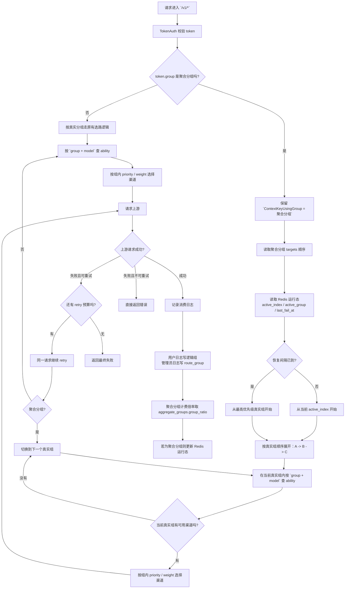

# 聚合分组 V1 设计说明

## 目标

在不破坏现有“真实分组 -> ability -> channel”底层结构的前提下，为 `new-api` 增加一层对外可见的聚合分组：

- token 仍然单选一个 `group`
- token 可以绑定真实分组或聚合分组
- 企业用户创建 token 时只看到聚合分组
- 聚合分组内部按真实分组顺序选路、失败切换、懒恢复
- 最终计费倍率固定取聚合分组倍率，不跟随底层真实组倍率变化

## 范围与边界

V1 已实现：

- 独立的聚合分组数据模型与管理员 CRUD
- 聚合分组绑定多个真实分组并支持顺序
- 请求按聚合分组展开真实分组链路
- 请求失败后沿用现有 retry 机制在真实分组链路内继续 fallback
- 聚合分组运行时状态按 `聚合分组 + 模型` 维度存储
- 恢复采用懒恢复，不引入后台扫描任务
- 聚合分组倍率覆盖最终 group ratio
- 聚合分组支持独立配置“状态码重试规则”，覆盖系统默认 retry 状态码策略
- token 页、定价页、模型页、用户分组接口不再向企业用户暴露底层真实组

V1 不做：

- 聚合分组嵌套聚合分组
- 模型级 fallback 链
- 基于错误率/成功率的自动学习或健康度跳过
- 独立后台定时恢复任务

## 数据结构

新增表：

### `aggregate_groups`

- `id`
- `name`
- `display_name`
- `description`
- `status`
- `group_ratio`
- `recovery_enabled`
- `recovery_interval_seconds`
- `retry_status_codes`
- `visible_user_groups`
- `created_time`
- `updated_time`
- `deleted_at`

说明：

- `visible_user_groups` 使用 `TEXT` 存 JSON 数组，兼容 SQLite / MySQL / PostgreSQL
- `retry_status_codes` 使用 `TEXT` 存状态码范围字符串，例如 `401,403,429,500-599`
- `status` 使用启用/禁用整型状态，风格与现有模型一致

### `aggregate_group_targets`

- `id`
- `aggregate_group_id`
- `real_group`
- `order_index`

说明：

- 一个聚合分组至少有一个 target
- `real_group` 只能引用真实分组，不能引用聚合分组
- `order_index` 表示链路优先级，值越小优先级越高

## 运行时设计

### 请求流转图

### 两类分组概念

- 逻辑组 / 计费组：`token.group`
- 实际选路组：当前请求命中的真实分组

对于真实分组 token：

- `ContextKeyUsingGroup` 继续等于真实分组

对于聚合分组 token：

- `ContextKeyUsingGroup` 保持聚合分组名
- `ContextKeyAggregateGroup` 保存聚合分组名
- `ContextKeyRouteGroup` 保存实际命中的真实分组
- `ContextKeyRouteGroupIndex` 保存实际命中的真实分组顺序
- `ContextKeyAggregateStartIndex` 保存本次请求开始时的优先级起点
- `ContextKeyAggregateRetryIndex` 保存失败后下一次 retry 应从哪个真实分组继续

### 选路策略

- 入口判断 `token.group` 是否为聚合分组
- 若不是，沿用现有真实分组选路逻辑
- 若是，读取聚合分组 targets，按顺序展开
- 每个真实分组内部继续复用现有 `ability` + `priority` + `weight` 选路逻辑
- 当当前真实分组在当前 retry 层级没有可用渠道时，切换到下一个真实分组
- 整体 retry 预算仍沿用现有 `common.RetryTimes`
- 当前真实分组上游返回“可重试失败”时，下一次 retry 从下一个真实分组开始，而不是重新回到当前真实分组
- 切到下一个真实分组后，该真实分组内部始终从自己的最高优先级开始选路
- 若当前真实分组内部存在更低优先级可用渠道，则会先在当前真实分组内继续尝试下一优先级，再切换到下一个真实分组

### 聚合分组级重试状态码规则

- 聚合分组新增 `retry_status_codes` 配置项
- 留空时：沿用系统全局状态码重试规则
- 非空时：仅当前聚合分组按该配置判断“状态码是否允许继续 A -> B -> C”
- 格式复用现有状态码范围语法，例如：
  - `401,403,429,500-599`
  - `500-599`
  - `401,429`
- 该配置只覆盖“基于 HTTP 状态码”的 retry 判断
- `skip_retry` 错误、显式不可重试错误仍不会进入聚合 fallback
- 非状态码网络错误（如 `client.Do` 失败）仍按现有非状态码失败逻辑处理

### 懒恢复状态

运行时状态按 `aggregate_group + model` 存储：

- `active_index`
- `active_group`
- `last_fail_at`
- `last_success_at`
- `last_switch_at`

优先存 Redis；无 Redis 时退化为进程内 `sync.Map`。

恢复规则：

- 若当前已降级且恢复间隔未到，则从 `active_index` 开始
- 若恢复间隔已到，则从最高优先级真实分组重新探测
- 只有成功请求才会更新持久状态
- 回到最高优先级真实分组成功后，清空失败时间并恢复 `active_index = 0`

## 计费规则

### 真实分组

- 保持现有逻辑
- 优先使用 `GroupGroupRatio`
- 否则使用 `GroupRatio`

### 聚合分组

- 直接使用 `aggregate_groups.group_ratio`
- 不读取底层真实分组倍率
- 不叠加 `GroupGroupRatio`

实现上通过统一的 `ResolveContextGroupRatioInfo` 完成，已接入：

- 预扣费倍率计算
- 实时/音频结算
- 异步任务差额结算快照

## 接口与用户暴露

### 管理员接口

- `GET /api/aggregate_group`
- `GET /api/aggregate_group/:id`
- `POST /api/aggregate_group`
- `PUT /api/aggregate_group`
- `DELETE /api/aggregate_group/:id`

### 用户可见分组

用户实际“可用组”和“可见组”拆开：

- `GetUserUsableGroups`
  - 用于 token 认证与实际可用性判断
  - 会包含真实分组和用户可见的聚合分组
- `GetUserVisibleGroups`
  - 用于 token 创建页、定价页、模型页等 UI 暴露
  - 会隐藏被可见聚合分组覆盖的真实分组

这样保证：

- 存量真实分组 token 仍可继续使用
- 新建 token 时企业用户只看到聚合分组

### 模型与定价暴露

- `/api/user/models`
  - 聚合分组返回其 targets 对应真实分组模型并集
- `/api/pricing`
  - `group_ratio` 返回可见分组倍率
  - `enable_groups` 做可见组映射，不暴露底层真实分组
- `/api/user/self/groups`
  - 返回分组 `type`，前端据此展示“聚合”标签

## 日志设计

对用户：

- `logs.group` 仍写逻辑组
- 聚合分组 token 只显示聚合分组名

对管理员：

- 真实命中的真实分组写入 `other.admin_info`
- 字段包括：
  - `aggregate_group`
  - `route_group`
  - `route_group_index`
  - `aggregate_start_index`
- 运行时日志额外打印聚合 fallback 链路，例如：
  - `aggregate fallback retry: aggregate_group=... failed_group=A next_group=B`
  - `aggregate fallback exhausted: aggregate_group=... failed_group=B no next route group`

错误日志与消费日志都已接入。

## 前端实现

新增页面：

- `聚合分组` 独立后台菜单页
- 列表页支持查看倍率、可见用户组、真实分组链与恢复策略
- SideSheet 支持创建/编辑
- 真实分组链支持顺序调整

修改页面：

- token 编辑页的分组下拉支持 `aggregate` 类型标签
- 编辑历史 real-group token 时，如果该分组已从可见列表隐藏，前端仍允许保留原分组
- 侧边栏与管理员模块配置新增 `aggregate_group`

## 测试策略

已覆盖的测试面：

- 聚合分组模型的 visible user groups round-trip
- 聚合分组删除时同步删除 targets
- 用户可见组与可用组拆分
- 聚合倍率覆盖 group ratio
- 聚合分组运行时状态写入/读取
- 聚合组按当前 active group 选路
- 恢复间隔到期后回切高优先级真实分组
- token 创建允许聚合分组
- token 创建拒绝已隐藏真实分组
- 聚合分组 CRUD 控制器入口

回归验证：

- `go test ./...`
- `bun run build`

### 待补充的联调与异常验证

为了保证不影响线上现有能力，并确认聚合分组在真实异常下行为符合预期，后续还需要补以下手工/集成验证：

#### 1. 普通分组回归

- 普通分组 token 创建、编辑、调用成功
- 普通分组调用后的用户日志、原始日志、token 扣费正常
- `auto` 分组 token 调用成功，行为与改造前一致
- 渠道管理、用户管理、模型管理页面的关键路径未被新功能影响

#### 2. 聚合分组主链路验证

- 聚合分组 token 正常调用成功
- 逻辑组记录为聚合分组名
- 管理员原始日志 `other.admin_info.route_group` 记录真实命中组
- 聚合分组倍率正确覆盖最终扣费倍率
- 聚合分组模型暴露、定价页暴露、token 下拉暴露不泄露底层真实组

#### 3. 失败切换验证

- 第一优先级真实组不可用时，自动切换到第二优先级真实组
- 第一优先级真实组返回 retryable 5xx/超时时，自动 fallback
- 所有真实组都不可用时，返回无可用渠道错误
- fallback 后日志中的 `route_group` 应反映实际命中真实组

#### 4. 懒恢复验证

- 当前状态已降级到低优先级真实组
- 恢复间隔未到时，请求继续命中当前低优先级真实组
- 恢复间隔到期后，请求重新优先探测高优先级真实组
- 高优先级恢复成功后，状态重新回切

#### 5. 不应 fallback 的异常

- 请求参数错误
- 模型不支持
- skip-retry 类型错误
- 这些错误应直接失败，不能误切到下一个真实组

#### 6. 模型名映射验证

- 聚合链上的每个真实组都必须在“模型”列表中声明统一公共模型名
- 若真实上游模型名不同，则通过“模型重定向”映射到实际模型名
- 验证 fallback 到第二真实组时，不需要用户手动改模型名
- 验证模型重定向后的上游模型名与预期一致

#### 7. Redis 与状态验证

- Redis 正常时，聚合分组运行时状态跨请求生效
- Redis key 过期后，状态可以重新建立
- 如 Redis 不可用，单机模式下退化逻辑仍可运行

### 推荐的上线前最小验收清单

- 空库启动一次，确认新表自动创建
- 老库升级一次，确认不会破坏旧数据
- 普通分组 token 成功调用 1 次
- `auto` token 成功调用 1 次
- 聚合分组 token 成功调用 1 次
- 聚合分组强制 fallback 成功 1 次
- 聚合分组懒恢复成功 1 次
- 用户日志和管理员原始日志各检查 1 次
- 模型重定向场景检查 1 次
- token 扣费与日志 quota 检查 1 次

## 已落实的约束

- 设计文路径固定为 `2dev/doc/aggregate-group-design.md`
- 执行日志固定为 `2dev/doc/迭代开发日志.md`
- 每个小点在测试通过后再勾选
